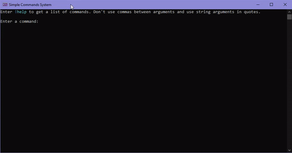

## Folders
- **System** - Main code
- **Commands** - Sample commands
- **ConsoleMusic** - Music using Console.Beep()
- **AsciiArts** - Ascii art for one sample command 


## Create commands
```CSharp
using System;
using SCS.System;

namespace SCS.Commands
{
	internal class SampleCommands
	{
		public const string Prefix = "s!";

		private SampleCommands() { }

		Don't use spaces for the command name.
		Use null in the prefix/description to set the standard value. 
		[Command(Prefix, "sample-command-name", "Sample command description.")]
		public static void SampleCommand(string text) // The method must be static!
		{
			AdvancedConsole.WriteLine(text);
		}
	}
}
```

Command methods can have overloaded versions and parameters with default values.

You can add multiple attributes to a method so that the command can be invoked with multiple names.


## Prepare commands for use 
[Program.cs](SCS/Program.cs)


## Use commands

